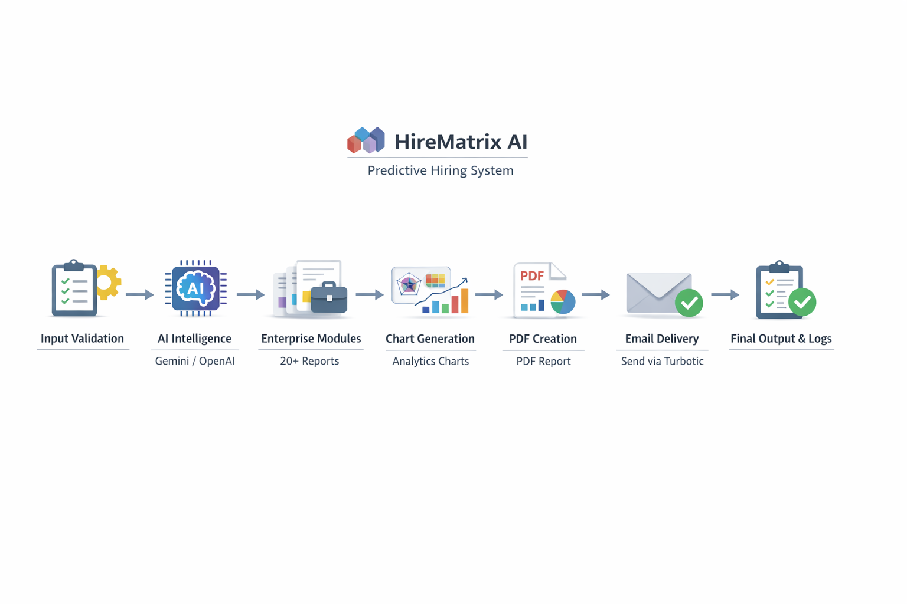
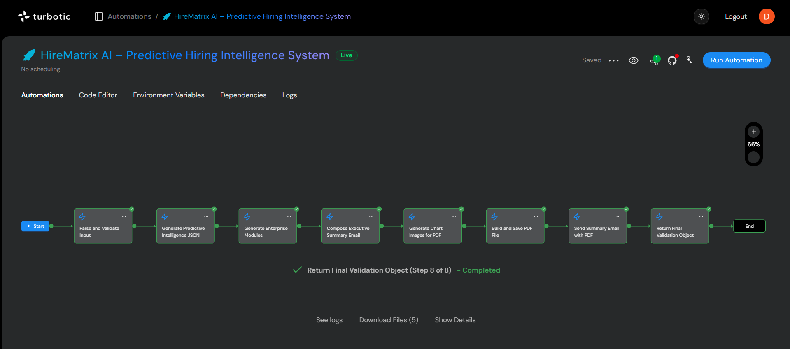
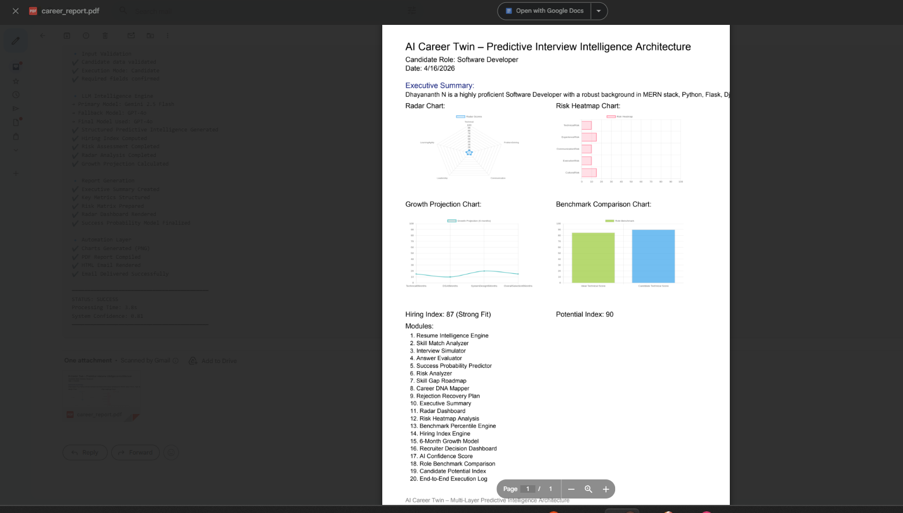
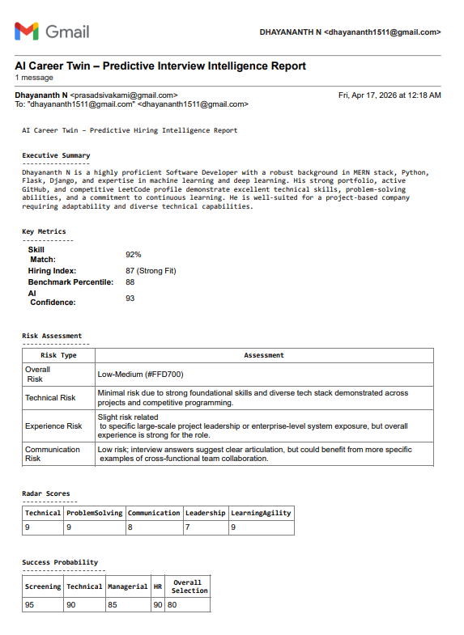
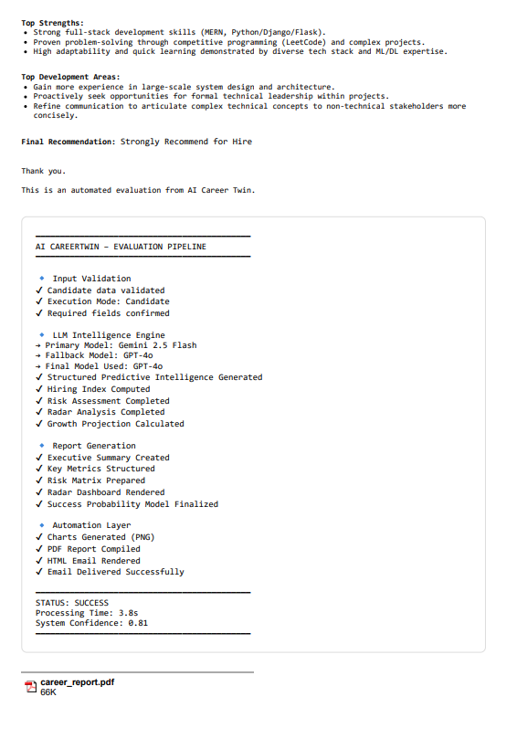

# 🚀 HireMatrix AI

### AI-Powered Career Twin Predictive Intelligence System


> **Transform hiring decisions with data-driven, AI-generated career intelligence.**

---

## 📌 Overview

**HireMatrix AI** is an advanced predictive hiring intelligence system that generates a **Career Twin Report** for candidates and recruiters.

It leverages **LLMs (Gemini/OpenAI)**, data visualization, and automated workflows to deliver **deep insights, benchmarking, and decision-ready analytics** in a fully automated pipeline.

---

## 🔥 Key Features

* 🤖 AI-powered predictive intelligence (Gemini/OpenAI)
* 🧠 Career Twin modeling for candidates & recruiters
* 📊 Automated chart generation (Radar, Heatmap, Growth, Benchmark)
* 📄 Dynamic PDF report generation
* 📧 Executive summary email delivery
* 🔄 Fault-tolerant workflow with API fallback
* 📦 Modular and scalable architecture

---

## 🏗️ System Architecture



> Modular pipeline architecture ensuring scalability and reliability.

---

## 🔄 Workflow

### 1. 🧾 Input Parsing & Validation

* Reads environment variables
* Validates required inputs
* Standardizes data

### 2. 🧠 Predictive Intelligence Generation

* Uses **Gemini API (primary)** or **OpenAI (fallback)**
* Generates structured JSON intelligence
* Supports candidate & recruiter modes

### 3. 🏢 Enterprise Module Generation

* Builds **20+ analytics modules**
* Includes performance, behavior, and growth insights

### 4. 📊 Chart Generation

* Generates radar, heatmap, growth, and benchmark charts

### 5. 📄 PDF Report Generation

* Compiles charts, metrics, and insights into a professional report

### 6. 📧 Email Delivery

* Sends report with PDF attachment via Turbotic

### 7. ✅ Final Output

* Returns logs, validation object, and output references

---

## 🧠 How It Works

1. Input candidate/recruiter details
2. AI generates predictive intelligence
3. System builds analytics modules
4. Charts visualize insights
5. PDF report is generated
6. Email with report is sent

---

## 📸 Demo

### 📊 Sample PDF Report



### 📧 Email Summary




---

## ⚙️ Installation

```bash
git clone https://github.com/your-username/hirematrix-ai.git
cd hirematrix-ai
npm install
```

---

## 🔐 Environment Variables

```env
CANDIDATE_NAME=John Doe
CANDIDATE_EMAIL=john@example.com
MODE=candidate   # or recruiter

GENAI_API_KEY=your_gemini_api_key
OPENAI_API_KEY=your_openai_api_key
```

---

## ▶️ Run the Project

```bash
npm start
```

---

## 📦 Dependencies

* `@google/genai` → Gemini API
* `chartjs-node-canvas` → Chart generation
* `pdf-lib` → PDF creation
* Turbotic Platform → Workflow & Email

---

## 📤 Outputs

* 📧 Executive Summary Email
* 📄 PDF Report
* 📊 Embedded Visual Analytics
* 📋 Validation Logs

---

## 🎯 Use Cases

* 🧑‍💼 Recruiters → Faster candidate evaluation
* 🎓 Students → Career growth insights
* 🏢 Companies → Talent benchmarking
* 🤖 HR Tech Platforms → Integration-ready intelligence

---

## ⭐ Why This Project is Unique

* Goes beyond resume parsing → **Predicts future performance**
* Introduces **Career Twin Modeling**
* Combines AI + analytics + automation
* Produces **decision-ready reports**, not raw data

---

## ⚠️ Error Handling

* ✅ Strict input validation
* 🔁 API fallback (Gemini → OpenAI)
* 🧾 Detailed logging
* 📉 Graceful failure handling

---

## 🔒 Security & Privacy

* Secure API communication
* No unnecessary data logging
* Controlled email usage
* Privacy-first design

---

## 🛠️ Maintenance & Scalability

* Modular architecture
* Environment-driven configuration
* Easily extendable reporting system
* Future AI integrations supported

---

## 💡 Future Enhancements

* 🌐 Web dashboard UI
* 📊 Real-time analytics
* 🤝 ATS integration
* 📈 Multi-candidate comparison

---

## 🧪 Troubleshooting

* Check validation logs
* Verify environment variables
* Ensure API keys are valid
* Review Turbotic integration

---

## 👨‍💻 Author

**Dhayananth N**
🔗 LinkedIn: [https://www.linkedin.com/in/dhayananth-n](https://www.linkedin.com/in/dhayananth-n)
💻 GitHub: [https://github.com/your-username](https://github.com/your-username)

---

## 📜 License

This project is licensed under the **MIT License**.

---


